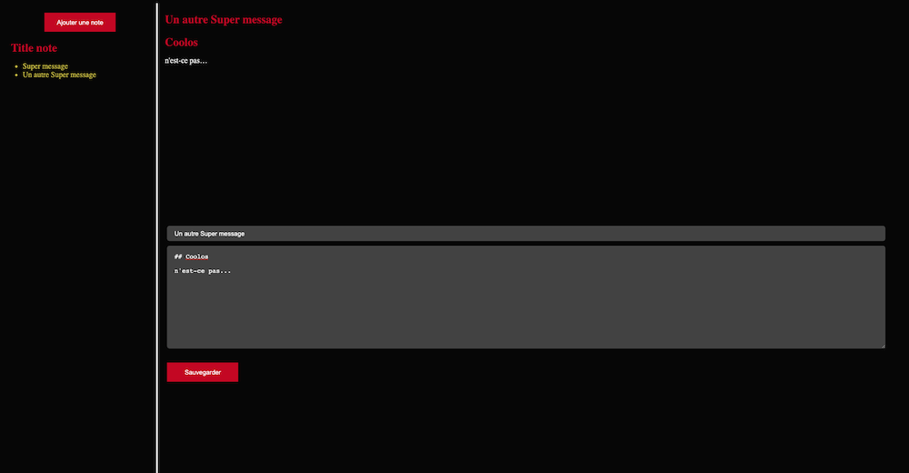

# DoNoteReact

Take notes in Markdown and store them in Localstorage.
Developped in one day for THP Next bootcamp 2021

  

## Tech

Javascript and [React](https://github.com/facebook/react), [Node Sass](https://github.com/sass/node-sass).

Use of [Showdown](https://github.com/showdownjs/showdown)

## Potential Improvements

Acces and modify notes :sweat_smile:
Auto-save
Animations (AnimeJS)

## Contributors

- [:palm_tree: Benjamin Serval](https://github.com/BenjaminServal)
- [:evergreen_tree: Clémentine Fouqué](https://github.com/Clem-svg)
- [:deciduous_tree: Marie Dechaux](https://github.com/mariedx)
- [:seedling: Mathieu Joly](https://github.com/mathieu-superpose)
- [:cactus: Hugo Péran Séjourné](https://github.com/HugoPeranSejourne)
